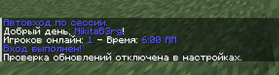

[ ] Перевести LiteBans (по смешному!!!) (я половину немного перевёл)
[+] Узнать границу мира (и если что ограничить его хотя бы на 3000 чтобы мир не весил нахуй 2 терабайта) ---  сделал, у тебя границы во всех мирах теперь 5к на 5к
[ ] *Доделать стеш в ките (откуда берутся предметы) (желательно добавить туда предметы из доншопа)
[ ] *Убедиться в стакании зелье
[ ] Сделать пост в тгк с списком функций (арены, киты, бесплатный доншоп) 
[ ] Поставить барьер вокруг арены в два слоя
    [ ] Так же заприватить арены чтобы они не ломались от заряда ветра, но их можно было использовать (кидая под себя) (тестировать приват без OP пж)
[+] Сделать вайтлист на вход с джавы  --- сделал только для людей с опкой
[ ] АНТИЧИТ!! ЧТобы он хотя бы в логи писал о подозрительных действиях
[ ] Дбавить уведомление о входе и выходе врага
[+-] Отключить уебанское уведомление при входе на сервер (У ВАС НЕТ НОВЫХ СООБЩЕНИЙ!!!!} --- ЕБАНАТ ТЫ О ЧЕМ СУККА???
  
